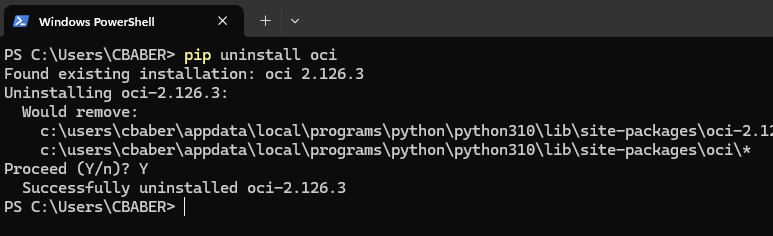

### Quick Reference to Install Python SDK on Windows with OCI Python SDK
Want to get started developing against the Oracle Cloud Infrastructure (OCI) with those python coding skills you picked up? This video shows how to go from zero to executing your first python script on Windows. It is designed for those developers who don't want to wade through documentation, just want to dive in and get started. Lets get started. 

- Open Powershell on your PC. 


- Issue the following command in powershell to get the version of Windows you are running.
```
slmgr /dlv
``` 


- Check to see if python is installed already. 
```
python --version
```

if installed you will see something like this showcasing the version installed as well.  


if not installed you will see something like this. 


- Navigate to the following link to see the supported versions of python for the OCI python SDK for your Windows OS version. [Supported Python Versions for SDK by OS](https://docs.oracle.com/en-us/iaas/Content/API/Concepts/cliconcepts.htm#Requirements__SupportedPythonVersionsandOperatingSystems)


- Install a supported version of Python for your OS. The executables can be downloaded from here. [Download Python](https://www.python.org/downloads/windows/)

- Test python install in powershell.
```
python --version
```

- Check to pip install version. PIP is a package manager for Python packages. 
```
pip --version
```

- (Optional) You most likely will have a updated version of pip if you install python. However, if older version is present you may want to upgrade by navigating to your python install directory in powershell and running the following upgrade command. 

```
python.exe -m pip install --upgrade pip
```

- Now we will install the python sdk. To install it run the following command. 
```
pip install oci
```

- Create a .oci directory to house your oci config file. The oci config file tells your python SDK which tenancy and user you want to connect too. It is best to do this in your home path. For example C:\Users\CBABER\ would be an user homepath. Once we navigate to the home directory, we will launch notepad to create the .oci config, if you have multiple tenancies I would suggest adding a .<tenancyname> at the end of your config file name. 
```
cd $HOME
mkdir $HOME\.oci
cd $HOME\.oci
notepad config.chipspicks
```

- We will need to create or leverage a OCI fingerprint for the user we wish to connect to OCI with inside the python sdk. Navigate to your identity on OCI. If a fingerprint exists you can leverage it. Otherwise you will need to create a new one. Once created you can copy over the information required for your config file. I suggest watching the youtube video to follow these steps. 

- To run the python sdk for OCI you also need a supported version of OpenSSL. Execute the following command in powershell to see which version of openssl is installed on your machine. At the time of this recording the supported version of OpenSSL for the Python SDK is version 1.0.2 or newer. Check your version of open SSL. 
```
python -c "import ssl; print(ssl.OPENSSL_VERSION)"
```

- If your version is not meeting the min, then go here and download/install the executable that matches your windows OS. (Install OpenSSL)[https://slproweb.com/products/Win32OpenSSL.html]


- With everything in place lets run our first python SDK program. Place the code below in a new file called listCompartments.py in your $HOME directory.

```
import oci
print("Starting Program");
from oci.config import from_file
# Config file is read from user's home location i.e., ~/.oci/config
config = from_file(file_location=".oci/config.chipspicks")  
# root compartment OCID
COMPARTMENT_ID="<add root compartment id>" 
print(COMPARTMENT_ID);
identity_client = oci.identity.IdentityClient(config)
list_compartments_response = identity_client.list_compartments(compartment_id=COMPARTMENT_ID,compartment_id_in_subtree=True)
# Get the list of compartments including child compartments except root compartment
compartmentlist = list_compartments_response.data
# Get the details of root compartment & append to the compartment list so that we have the full list of compartments in the given tenancy
root_compartment = identity_client.get_compartment(
    compartment_id=COMPARTMENT_ID).data
compartmentlist.append(root_compartment)
print(compartmentlist);
```

- Execute your example python script. 
```
python listCompartments.py
```

- If you want to remove the OCI Python SDK issue the following command. 
```
pip uninstall oci
```



- Test Command for show all 
```
python showoci.py -c -d -csv  C:\temp\output -cf C:\Users\CBABER\.oci\config
```